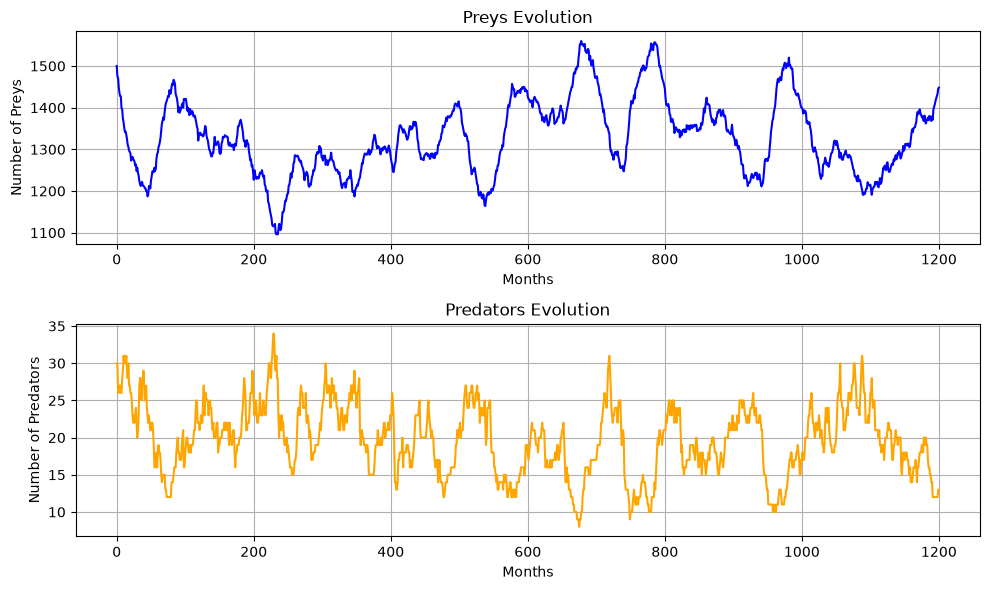
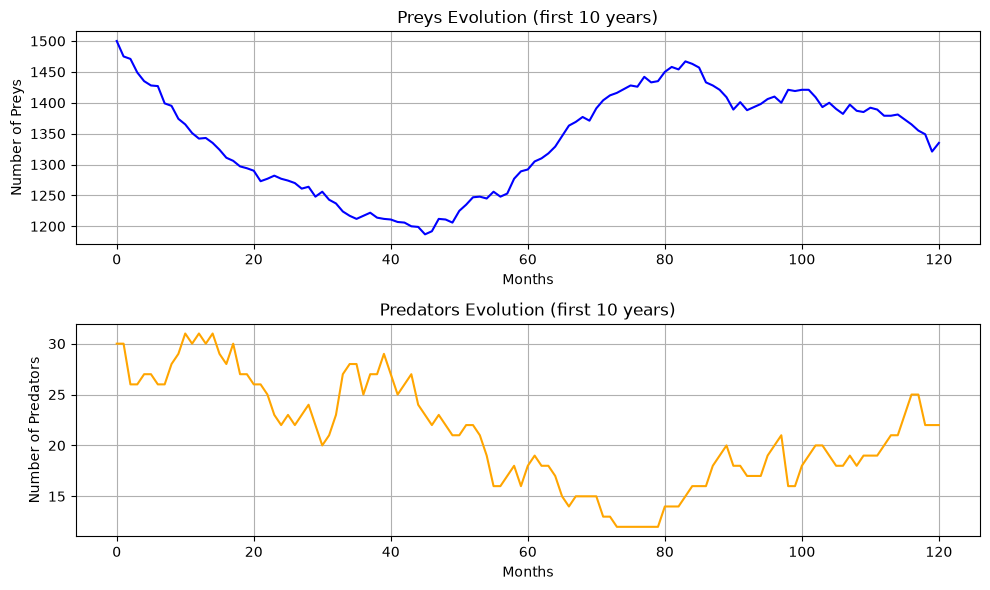
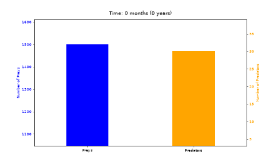
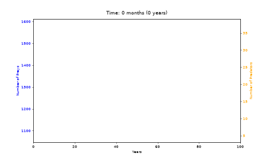
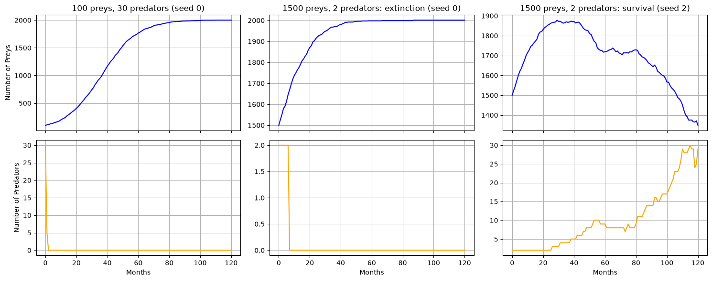

# Stochastic predator-prey model: modeling lion and antelope population oscillations with random variables

> Individual mini-project · *Operations Research: Stochastic Models* (IE232) · KAIST (exchange year), Fall 2024 · Python, NumPy, Matplotlib

For this course, each student had to work on a stochastic model of their choice, and I chose to model how the numbers of predators and prey in an ecosystem evolve over time, using lions and antelopes as an example.

Predator-prey dynamics are usually described with deterministic differential equations (the Lotka-Volterra model). I wanted to build a version from the distributions we used in the course instead, as a way to practise them on a system that changes over time. Births are counts of events, so I modeled them with Poisson distributions, and the number of animals that survive a month out of a given population is modeled with Binomial distributions. Most of the work was choosing the parameters and the formulas for the hunting and survival probabilities so that the populations behave in a plausible way. With the final parameters, the two populations oscillate irregularly over the 100 simulated years, with cycles of roughly 8 to 10 years.

## Model

The time unit is one month. At each step, the births and deaths are drawn and the two populations are updated. The simulation runs for 100 years (1,200 steps), starting from 1,500 antelopes and 30 lions. With N antelopes and P lions at the start of a month, and C antelopes eaten during that month:

| Mechanism | Distribution | Parameter |
|---|---|---|
| Antelope births | Poisson | mean (1/12) · N · (1 − N/2000) |
| Antelopes eaten (C) | Binomial(N, p) | p = 3 · (P/N) · √(N/2000) · √(1 − P/50) |
| Lion survival | Binomial(P, s) | s = exp(−(P/C)³ / 5) |
| Lion births | Poisson | mean (1/24) · P |

## Parameters

I chose the reproduction rates from real-world data and assumed that half of each population is female. A lioness gives birth to two cubs every two years on average, which gives a rate of (2/24) × (1/2) = 1/24 per lion per month. A female antelope has two young per year, which gives (2/12) × (1/2) = 1/12 per antelope per month. The predation rate of 3 is the number of antelopes a lion hunts per month.

The carrying capacities (2,000 antelopes and 50 lions) limit the growth of the antelopes, which stands for limited natural resources, and they also regulate hunting according to the densities of both species: hunting is less successful when antelopes are scarce and when the number of lions approaches its capacity. Above their capacity, antelopes have no births. The constant k = 5 in the survival probability adjusts it so that the lions' survival is low when they caught few antelopes and high when they caught enough. A small ε = 10⁻⁴ is added to the denominators to avoid dividing by zero.

## Results



<sub><i>Monthly number of antelopes (top) and lions (bottom) over 100 years, in the seed-42 run.</i></sub>

**Oscillations.** The two populations oscillate over the 100 years of the simulation. The antelopes stay between 1,096 and 1,560 (mean 1,328) and the lions between 8 and 34 (mean 20). The oscillations are irregular, so their period is difficult to estimate: the autocorrelation of the antelope series has its first peak at about 8 years, while in my report I estimated about 10 years by eye from an earlier run. A high number of lions is usually followed about a year later by a low number of antelopes (correlation of −0.79 with a one-year lag).



<sub><i>The first 120 months of the same run.</i></sub>

**One cycle.** The first 10 years of the same run show one cycle in more detail. While there are many lions, the antelopes decrease from 1,500 to about 1,190 by month 45. The lions then have less food and decrease to 12 by month 72, and the antelopes increase again to about 1,465 by month 83, before the lions start to increase again.

<p align="center">
  
  
</p>

<sub><i>The same 100-year run month by month, as bars (left) and as lines (right). Antelopes are on the blue axis and lions on the orange one.</i></sub>

## Limit cases

I also ran the model with extreme starting populations over 10 years.



<sub><i>Antelopes (top) and lions (bottom) over 10 years for three starting populations. Since the outcome is random, each panel uses the first seed that produces the outcome shown.</i></sub>

**Few prey.** With 100 antelopes and 30 lions (left), the lions starve within two months, and the antelopes then grow without predators until they reach their carrying capacity of 2,000. This may be close to reality, since predators have difficulty finding rare prey, but the prey could also go extinct, which cannot happen in this model.

**Few lions.** With 2 lions and 1,500 antelopes, two outcomes are possible: the lions die before they reproduce (middle, after 7 months), or their number slowly increases (right). In the second case there are about 30 lions after 10 years, and the antelopes, which first grew to about 1,870, are decreasing back towards the range of the main run.

## Possible improvements

- **Hand-tuned parameters.** Apart from the reproduction and predation rates, the parameters (carrying capacities, the square-root terms in the hunting probability and k) were chosen by hand so that the populations stay in a plausible range. The model is not fitted to observed population data.
- **No sexes.** Animals reproduce on their own, so a single remaining antelope can still have offspring. Each animal could be given a sex, with females being pregnant for a gestation period before giving birth.
- **No ages.** Newborns can reproduce right away and die at the same rate as adults. With age classes, animals could only reproduce after a certain age and would be more likely to die as they get older.
- **No prey extinction.** The hunting probability decreases when antelopes become rare, so the antelopes cannot be hunted to extinction. If that behaviour is wanted, the formula could penalize low prey density less.
- **One run.** The figures show a single run with a fixed seed. The population ranges and the length of the cycles vary from one run to another.

## How to run

```bash
python -m venv .venv && source .venv/bin/activate
pip install -r requirements.txt
jupyter notebook predator_prey.ipynb
```

The notebook uses a fixed seed (42), so running it top to bottom reproduces all the figures above. It takes about two minutes, most of which is spent writing the two GIFs. To try other starting populations, change `initial_prey` and `initial_predators` in the first code cell, or call `simulate(initial_prey, initial_predators, time_steps)` directly.

## Repository structure

```
predator_prey.ipynb    parameters, simulation, plots, statistics, animations and limit cases (with outputs)
figures/               the figures and animations above, all saved by the notebook
report.pdf             the two-page report I handed in (December 2024)
requirements.txt       pinned dependencies
```

## Report and 2026 cleanup

The two-page report I wrote for the course in November and December 2024 (final version of 4 December 2024) is included as [`report.pdf`](report.pdf). Its numbers come from an earlier run without a fixed seed, so they differ slightly from the ones above, and in its carrying-capacity experiment the values for prey and predators are swapped: they should read 2,000 → 3,000 for prey and 50 → 100 for predators.

In 2026 I cleaned and documented the notebook for publication with [Claude Code](https://claude.com/claude-code). I added a fixed seed, wrapped the simulation in a function to plot the limit cases from the report, added the 10-year plot and the line-chart animation, saved the animations as GIFs instead of an MP4, and re-ran the notebook from scratch. I also fixed a crash: when the antelopes exceeded their carrying capacity, the original code drew births from a Poisson distribution with a negative mean. Births now stop above the capacity, and every run that worked before gives exactly the same result.
